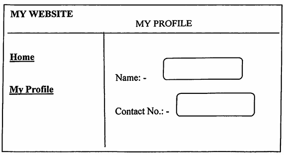

# Web Programming Laboratory

- Course code: MCA01605
- Course prerequisite: computer network and information security

## Course Objectives

- To learn the fundamentals of web essentials and markup languages
- To use the client side technologies in web development
- To use the server side technologies in web development
- To understand the web services and frameworks

## Course Outcomes: CO606._

1. **Construct** client side web application using HTML, CSS and JavaScript - `[1-3]`
2. **Apply** the concept of bootstrap and WordPress in web application - `[4-6]`
3. **Create** a web application using AngularJS and jQuery - `[7-9]`
4. **Implement** web application using PHP and web sirvices - `[10-12]`

## List of Laboratory assignment

1. Create a static HTML page that displays the following output using frame

    

2. Design external CSS to set the following rules and link in the HTML file
    - a. Give Heading
    - b. Set paragraph with font 13
    - c. Set the text color as blue
    - d. Set heading text color as green

3. Write JavaScript code which will display Patient Master form having following fields Patient ID, Patient Name, Address, City, Contact Number, Date of Birth, Validate above fields with different criteria

4. Write a bootstrap example to create a grid with 50% split on small, medium and large devices

5. Design a responsive web page using HTML, CSS and Bootstrap

6. Create a website for resumes in WordPress

7. Build a navigation menu that highlights the selected entry. Use only Angular's directives.

8. Create an application for Students Record using AngularJS.

9. Write a program to How to get the value of a textbox using jQuery.

10. Write a program in PHP that formats a block of text (to be input by the user) based on preferences chosen by the user. Give your user options for color of text, font choice, and size. Display the output on a new page. Allow user the option of saving the information for the next time they visit. If they choose "yes" save the information in a cookie.

11. Create a form to capture Book details throught PHP. The HTML form should perform the following
    - a. Capture the data such as Book name, Author name, Publisher name, Category and Synopsis
    - b. Clears the form details when the Reset button is clicked
    - c. Submit the captured data when the Submit button is clicked

12. Write a program to implement web service for calculator applications using PHP.

13. Mini Project (Tentative List)
    1. BMI Calculator
    2. Blog Application
    3. Dice Roll Game
    4. Food Website
    5. Geography Table
    6. Instagram Clone
    7. Loan Calculator
    8. Maths quiz game
    9. Restaurant website
    10. Sports Website
    11. Sudoku solver
    12. Vat Calculator
    13. Virtual Keyboard
    14. Tourist website
    15. Invoice Generator
